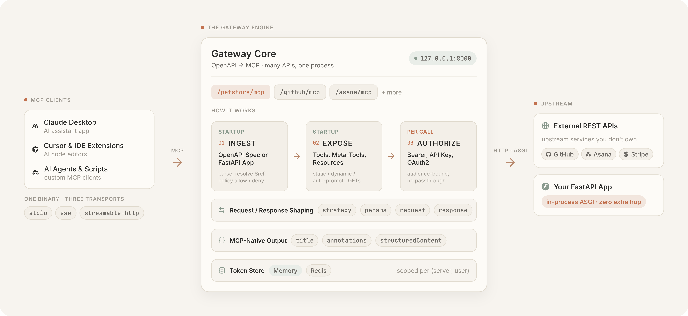

# OpenAPI MCP Gateway

[](https://github.com/mroops0111/openapi-mcp-gateway/actions/workflows/ci.yml)
[](https://pypi.org/project/openapi-mcp-gateway/)
[](https://pepy.tech/projects/openapi-mcp-gateway)
[](https://pypi.org/project/openapi-mcp-gateway/)
[](LICENSE)

Mount any OpenAPI (Swagger) spec as a [Model Context Protocol (MCP)](https://modelcontextprotocol.io/) server, or expose an existing FastAPI app the same way. Multiple APIs in one process, each with its own mount path and auth.

<p align="center">
  
</p>

```bash
uvx openapi-mcp-gateway --spec https://petstore3.swagger.io/api/v3/openapi.json
# Server live at http://127.0.0.1:8000/api/mcp
```

- **Multi-Spec, Multi-Auth.** Mount GitHub, an OAuth2 SaaS, and your internal API side by side, each with its own bearer / API key / OAuth2 auth and token namespace.
- **FastAPI-Native.** Decorate routes with `@mcp_tool` to expose them in-process over ASGI, no extra hop and no second spec to maintain.
- **Dynamic Exposure.** Front a huge spec with three `list → get → call` meta-tools instead of hundreds of schemas, so it never blows the LLM's context window.
- **Resource Auto-Promotion.** Set `mode: auto` and eligible GETs register as MCP resources instead of tools, keeping the tool list small while reads stay addressable by URI.
- **Spec-Compliant Authorization.** Audience-bound tokens with no silent passthrough to upstreams, plus protocol-native `annotations` and `structuredContent` on every tool.
- **Tool Name and Description Overrides.** Rewrite ugly `operationId`s and empty descriptions in YAML, no fork required.
- **Tool Shaping.** Declare a friendly input schema and rewrite the request and response with JSONata, turning a raw endpoint with a filter DSL and a bloated envelope into a clean two-argument tool.
- **Pluggable Token Store.** Memory by default, switch to Redis to share OAuth credential state across replicas. It holds OAuth tokens and client registrations, never MCP protocol sessions, so single-replica or non-OAuth deployments do not need it.
- **Every Transport.** Streamable HTTP and stdio on the same binary, from Claude Desktop and Cursor to any other MCP client. SSE still works but is deprecated in the 2026-07-28 spec, so new deployments should choose streamable HTTP.

---

## Installation

Add the gateway to your project with [uv](https://docs.astral.sh/uv/):

```bash
uv add openapi-mcp-gateway
```

Optional extras:

```bash
uv add "openapi-mcp-gateway[redis]"   # Redis token store, used for auth memoization
```

Requires Python 3.11+.

## Quick Start

### 1. Public API, No Auth

```bash
# `uv run` assumes you ran `uv add openapi-mcp-gateway` (see Installation above).
# To skip the install, swap in `uvx openapi-mcp-gateway` to run the published package directly.
uv run openapi-mcp-gateway --spec https://petstore3.swagger.io/api/v3/openapi.json --name petstore
```

Connect an MCP client to `http://127.0.0.1:8000/petstore/mcp`.

### 2. Bearer Token

```bash
export GITHUB_TOKEN="ghp_..."
uv run openapi-mcp-gateway \
    --spec https://raw.githubusercontent.com/github/rest-api-description/main/descriptions/api.github.com/api.github.com.json \
    --name github \
    --auth-type bearer \
    --auth-token '${GITHUB_TOKEN}'
```

For an API-key header, use config so the header name is explicit:

```yaml
servers:
  - name: petstore
    spec: https://petstore3.swagger.io/api/v3/openapi.json
    auth:
      type: api_key
      token: ${PETSTORE_API_KEY}
      api_key_header: api_key
```

### 3. OAuth2, Per-User Delegation (`authorization_code`)

The gateway runs its own OAuth server so each MCP client authenticates as its own end-user, with tokens minted per session.

```bash
export ASANA_CLIENT_ID="..." ASANA_CLIENT_SECRET="..."
uv run openapi-mcp-gateway \
    --spec https://raw.githubusercontent.com/Asana/openapi/master/defs/asana_oas.yaml \
    --name asana \
    --auth-type oauth2 \
    --auth-client-id '${ASANA_CLIENT_ID}' \
    --auth-client-secret '${ASANA_CLIENT_SECRET}' \
    --auth-scopes "openid,email,profile,users:read,workspaces:read"
```

### 4. OAuth2, Service Token (`client_credentials`)

The gateway holds its own credentials and shares one upstream token across every MCP client, no per-user OAuth dance:

```bash
export SVC_CLIENT_ID="..." SVC_CLIENT_SECRET="..."
uv run openapi-mcp-gateway \
    --spec ./service-api.json \
    --name svc \
    --auth-type oauth2 \
    --auth-flow client_credentials \
    --auth-client-id '${SVC_CLIENT_ID}' \
    --auth-client-secret '${SVC_CLIENT_SECRET}'
```

### 5. Multiple APIs at Once

Mix public, bearer, and OAuth2 services in a single config. Each server is mounted at `/{name}/mcp`:

```yaml
# servers.yml
host: "127.0.0.1"
port: 8000
url: http://127.0.0.1:8000   # public base URL for OAuth callbacks

servers:
  # Resource auto-promotion: eligible GETs become MCP resources, the rest stay tools.
  - name: petstore
    spec: https://petstore3.swagger.io/api/v3/openapi.json
    base_url: https://petstore.swagger.io/v2
    mode: auto

  # Dynamic exposure: ~1,200 GitHub ops behind three meta-tools instead of 1,200 tool schemas.
  - name: github
    spec: https://raw.githubusercontent.com/github/rest-api-description/main/descriptions/api.github.com/api.github.com.json
    exposure: dynamic
    auth:
      type: bearer
      token: ${GITHUB_TOKEN}

  # Per-user OAuth2 with audience-bound tokens, no passthrough.
  - name: asana
    spec: https://raw.githubusercontent.com/Asana/openapi/master/defs/asana_oas.yaml
    auth:
      type: oauth2
      client_id: ${ASANA_CLIENT_ID}
      client_secret: ${ASANA_CLIENT_SECRET}
      scopes: [openid, email, profile, users:read, workspaces:read]
```

What this gives you at `http://127.0.0.1:8000`:

- `/petstore/mcp`: 13 tools + 3 concrete resources + 3 resource templates, partitioned by `mode: auto` with no spec edits.
- `/github/mcp`: three meta-tools (`list_operations`, `get_operation`, `call_operation`) fronting ~1,200 endpoints.
- `/asana/mcp`: per-user OAuth2 against Asana's IdP, with tokens minted server-side (see [Authorization](#authorization)).

```bash
export GITHUB_TOKEN="ghp_..."
export ASANA_CLIENT_ID="..." ASANA_CLIENT_SECRET="..."
uv run openapi-mcp-gateway --config servers.yml
```

Runnable variants live in [`examples/`](examples/). Each YAML lists its prerequisites at the top.

`${ENV_VAR}` and `${ENV_VAR:-default}` work in any string field, resolved at request time. For OAuth2, `authorizationUrl` / `tokenUrl` / `scopes` are auto-detected from the spec's `securitySchemes`. Override with `auth.authorization_url` / `auth.token_url` / `auth.scopes` when the spec is incomplete.

### 6. Local Desktop Client (stdio)

For Claude Desktop, IDE integrations, or any MCP client that prefers stdio:

```json
{
  "mcpServers": {
    "petstore": {
      "command": "uv",
      "args": [
        "run",
        "--project", "/abs/path/to/your/project",
        "openapi-mcp-gateway",
        "--spec", "/abs/path/to/openapi.json",
        "--transport", "stdio"
      ]
    }
  }
}
```

## Authorization

The gateway runs its own authorization server and mints upstream tokens server-side, so each MCP client authenticates as its own end-user and never handles a third-party credential directly. Tokens are audience-bound and scoped to their `(server, user)` pair, so a token minted for one upstream is never replayed against another.

The gateway does not silently pass the MCP client's token through to third-party upstreams, in line with the MCP spec's [Access Token Privilege Restriction](https://modelcontextprotocol.io/specification/2025-11-25/basic/authorization#access-token-privilege-restriction). For `authorization_code` it mints per-user tokens against the upstream IdP per [RFC 8707](https://www.rfc-editor.org/rfc/rfc8707), and for `client_credentials` it uses its own service credentials. The one exception is the FastAPI integration, which runs in-process at the same OAuth audience, so the client's `Authorization` header is forwarded verbatim (see [Expose Your FastAPI App as MCP Tools](#expose-your-fastapi-app-as-mcp-tools)).

For `authorization_code`, the MCP access token lives 1 hour and the refresh token 24 hours by default. Each refresh issues a fresh refresh token, so the refresh TTL is the practical re-authorization cadence. A client that refreshes within it never has to sign in again, while one idle past it must re-authorize. Tune both per server with `auth.mcp_access_token_ttl` and `auth.mcp_refresh_token_ttl`.

Tool results are spec-compliant too. Every tool carries a protocol-native `title`, `annotations` (`readOnlyHint`, `destructiveHint`, `idempotentHint`), and `structuredContent`, so an agent can judge a tool before calling it and read structured error bodies without re-parsing text.

## Configuration

Run `uv run openapi-mcp-gateway --help` for the CLI reference. The [Quick Start](#quick-start) examples cover most setups. The full field reference is below.

Configuration merges in this order, with each layer overriding the previous: **defaults → YAML (`--config`) → CLI flags → `Gateway.run(...)` kwargs**. A layer only overrides the fields it actually sets, so `--log-level=DEBUG` won't reset `logging.format` from your YAML. Nested objects like `logging` and per-server `auth` merge field-by-field. The `servers` list is the exception, replaced wholesale rather than merged entry-by-entry.

<details>
<summary><b>Top-Level Fields</b></summary>

| Field | Type | Default | Description |
|---|---|---|---|
| `host` | string | `0.0.0.0` | Bind address (`0.0.0.0` = all interfaces). Clients on the same machine usually open `http://localhost:{port}` or `http://127.0.0.1:{port}`. |
| `port` | int | `8000` | Bind port |
| `url` | string | *(empty)* | Public base URL for OAuth redirects and discovery. When unset: `http://localhost:{port}` if `host` is `0.0.0.0`, otherwise `http://{host}:{port}`. Override when your registered redirect URI uses another host (tunnel, reverse proxy, etc.). |
| `transport` | string | `streamable-http` | `streamable-http`, `stdio`, or `sse` (deprecated) |
| `store.type` | string | `memory` | `memory` or `redis` |
| `store.redis_url` | string | `redis://localhost:6379` | Redis URL when `store.type: redis` |
| `logging.level` | string | `INFO` | `DEBUG`, `INFO`, `WARNING`, `ERROR`, `CRITICAL` |
| `logging.format` | string | `text` | `text` or `json` |
| `logging.file` | string |  | Mirror logs to this file |
| `servers` | list | required | List of per-server config entries |

</details>

<details>
<summary><b>Per-Server Fields</b></summary>

| Field | Type | Default | Description |
|---|---|---|---|
| `name` | string | required | Unique identifier. Mount path defaults to `/{name}` |
| `spec` | string | required | Path or URL to OpenAPI document (JSON or YAML) |
| `base_url` | string | from spec | Override the upstream base URL |
| `auth.type` | string | `none` | `none`, `bearer`, `api_key`, or `oauth2` |
| `auth.token` | string |  | Required for `bearer` / `api_key` |
| `auth.api_key_header` | string | `X-API-Key` | Header name for `api_key` |
| `auth.client_id`, `auth.client_secret` | string |  | Required for `oauth2` |
| `auth.scopes`, `auth.authorization_url`, `auth.token_url` |  | from spec | OAuth2 overrides when `securitySchemes` is incomplete |
| `auth.mcp_access_token_ttl` | int | `3600` | Lifetime in seconds of the MCP access token the gateway mints for `authorization_code` |
| `auth.mcp_refresh_token_ttl` | int | `86400` | Lifetime in seconds of the MCP refresh token. This is the practical re-authorization cadence, since each refresh slides the window forward |
| `policy.allow` | list |  | Only expose matching operations |
| `policy.deny` | list |  | Exclude matching operations |
| `timeout` | float | `90` | HTTP timeout in seconds |
| `exposure` | string | `static` | `static` registers one MCP tool per operation. `dynamic` registers three meta-tools (`list_operations`, `get_operation`, `call_operation`) for the LLM to walk on demand. |
| `mode` | string | `tool_only` | `tool_only` forces every operation to a tool and ignores any `resource` declaration. `auto` promotes eligible GETs (no required non-path parameter) to MCP resources, and spec-side `resource` opt-ins still apply as explicit overrides. |
| `operations` | map | `{}` | YAML-side `x-mcp-integration` overrides, keyed by `operationId`. Fully replaces (does not merge) the spec-side `x-mcp-integration` on that operation. Useful when you do not control the upstream spec. |

</details>

### Filtering Operations

Use `policy.allow` and `policy.deny` with `fnmatch` syntax against operation IDs (`getUsers`, `create*`) or method + path (`GET /users/*`):

```yaml
policy:
  allow: ["GET /repos/*"]
  deny:  ["GET /repos/*/actions/secrets*"]
```

Operations can also be opted in from the spec side with `x-mcp-integration: {tool: {}}` plus `policy.marked_only: true`. Filters apply in order: `marked_only`, then `allow`, then `deny`.

### Resource Exposure

Read-only `GET` operations are a better fit for the MCP **resource** primitive than for a tool. Most MCP clients do not auto-load resources into the LLM context, so promoting catalog-style endpoints to resources saves tokens without losing reachability.

The default `mode: tool_only` exposes every operation as a tool. Set `mode: auto` to promote eligible GETs (no required `query` / `header` / `body` parameter) to resources:

```yaml
servers:
  - name: petstore
    spec: https://petstore3.swagger.io/api/v3/openapi.json
    mode: auto
```

That covers the common case: against the vanilla Petstore3 spec it produces 13 tools, 3 concrete resources, and 3 resource templates, zero spec edits.

For finer per-operation control (rename the resource, set a custom URI template, set a non-JSON MIME type), use the `operations` map:

```yaml
servers:
  - name: petstore
    spec: https://petstore3.swagger.io/api/v3/openapi.json
    mode: auto
    operations:
      getPetById:
        resource:
          name: pet
          mime_type: application/json
      getInventory:
        resource:
          name: inventory
```

Keys are matched against `operationId`. An unknown id raises at startup so typos do not silently no-op. Each entry fully replaces (does not merge with) the spec-side `x-mcp-integration`. A runnable demo lives at [`examples/petstore-override.yml`](examples/petstore-override.yml).

If you own the upstream spec, write the same opt-in inline with `x-mcp-integration.resource`:

```yaml
paths:
  /pets/{petId}:
    get:
      operationId: getPet
      x-mcp-integration:
        resource:
          name: pet
          mime_type: application/json
          # uri_template: petstore://v2/pets/{petId}  # optional override, must start with "<server>://"
```

Declaring both `tool` and `resource` registers the operation on both surfaces. Resource declarations are validated at startup: non-`GET` methods, required non-path parameters, and `uri_template` values that do not start with `<server>://` abort `Gateway.from_config` with a concrete error. Subscriptions are not implemented because REST has no native push.

### Tool Name and Description Overrides

Real-world specs ship ugly `operationId`s (GitHub's `actions/list-jobs-for-workflow-run-attempt`) and empty descriptions (most of `gists/*`), leaving the LLM to guess intent from the name. The same `operations` map renames the tool and rewrites the description without forking the spec:

```yaml
servers:
  - name: github
    spec: https://raw.githubusercontent.com/github/rest-api-description/main/descriptions/api.github.com/api.github.com.json
    operations:
      pulls/list-files:
        tool:
          name: list_pull_request_files
          description: |
            List files changed in a pull request. Returns up to 3000 files,
            each with status (added / modified / removed), patch text, and
            line counts.
```

If you own the upstream spec, the inline form is `x-mcp-integration.tool` on the operation.

### Tool Shaping

A raw operation rarely makes a good tool. It may take a cryptic filter DSL, expose a dozen knobs the model should never touch, and wrap the few useful fields in a large envelope. `x-mcp-integration.tool` reshapes an operation on both sides without forking the spec, pairing a declarative input layer with [JSONata](https://jsonata.org/) expressions for the value transforms. Three keys work together.

- **`params` and `strategy`**: declare what the model sees.
- **`request`**: a JSONata expression that maps the friendly arguments onto the upstream request.
- **`response`**: a JSONata expression that reshapes the upstream body before it reaches the client.

#### Input Schema

`strategy` decides how `params` relates to the spec and is mandatory whenever `params` is set. Each `params` entry is then a JSON Schema fragment plus two flags.

- **`strategy`**:
  - **`merge`**: tweaks the operation's existing parameters and keeps the rest visible, so a parameter the spec does not define is an error.
  - **`replace`**: makes the declared entries the whole schema and drops every spec parameter, so it needs a `request` to route the friendly arguments upstream.
- **`type`**: one of `string`, `integer`, `number`, `boolean`, `array`, `object`, alongside the usual JSON Schema keywords (`enum`, `default`, `description`, `format`, `minimum`, `items`, and so on).
- **`required`**: lifts the parameter into the schema's required list.
- **`hidden`**: removes a spec parameter from the surface.

<details>
<summary><b><code>merge</code> Example</b></summary>

```yaml
operations:
  searchIssues:
    tool:
      strategy: merge
      params:
        internal_flag: { hidden: true }
        per_page: { default: 30 }
        sort: { description: "One of comments, created, updated." }
```

</details>

<details>
<summary><b><code>replace</code> Example</b></summary>

```yaml
operations:
  discover_movies:
    tool:
      strategy: replace
      params:
        sort:
          type: string
          enum: [popular, top_rated, newest]
          default: popular
        page:
          type: integer
          default: 1
      request: |
        {
          "sort_by": $lookup(
            {"popular": "popularity.desc", "top_rated": "vote_average.desc", "newest": "primary_release_date.desc"},
            sort
          ),
          "page": page,
          "include_adult": false,
          "language": "en-US"
        }
      response: |
        [results.{ "title": title, "overview": overview, "rating": vote_average }]
```

The model sees only `sort` and `page`. `request` maps them onto the raw query and injects the locale and safety flags, and `response` trims each result. `$lookup` translates a friendly enum into the raw value, and the surrounding `[ ... ]` keeps the result a list even for a single match.

</details>

#### Request and Response

`request` builds the entire upstream request, and `response` transforms a successful body. Both are optional and independent.

- **Routing**: a key that names a path placeholder fills the path, and the rest become query parameters for a body-less method or the JSON body otherwise.
- **Passthrough**: to forward the incoming arguments and change only a few, merge them with `$merge([$, { ... }])`.
- **Errors**: a broken expression is rejected at startup, and a runtime failure returns an `isError` result naming the side that broke.

A runnable end-to-end example lives at [`examples/movie-shaping.yml`](examples/movie-shaping.yml).

### Dynamic Exposure

For APIs with hundreds of operations (GitHub, Stripe, etc.), registering each as its own tool can blow the LLM's context window before the agent does anything. Set `exposure: dynamic` and the client sees three meta-tools instead:

```yaml
servers:
  - name: github
    spec: https://raw.githubusercontent.com/github/rest-api-description/main/descriptions/api.github.com/api.github.com.json
    exposure: dynamic   # default is 'static'
    auth:
      type: bearer
      token: ${GITHUB_TOKEN}
```

The three meta-tools:

- `list_operations()` returns `[{name, description}, ...]` for every operation on this server.
- `get_operation(name)` returns one operation's JSON Schema for input arguments.
- `call_operation(name, arguments)` invokes that operation against the upstream.

The LLM walks `list → get → call` to discover and invoke operations on demand. Auth, path templating, and per-operation request shape match static mode. Only the surfacing changes.

`exposure` is per-server, so `/github/mcp` can run `dynamic` while `/petstore/mcp` runs `static` in the same process.

### Logging

Configure via the `logging.*` YAML keys or via CLI flags (`--log-level`, `--log-format`, `--log-file`). `-v` and `-q` are shortcuts for `DEBUG` and `WARNING`. CLI flags override YAML field-by-field, following the precedence rule above.

## Python API

Use the gateway as a library:

```python
from openapi_mcp_gateway import Gateway

gateway = Gateway()
gateway.add_server(
    name="petstore",
    spec="https://petstore3.swagger.io/api/v3/openapi.json",
)
gateway.add_server(
    name="github",
    spec="./github-openapi.json",
    auth={"type": "bearer", "token": "${GITHUB_TOKEN}"},
    policy={"allow": ["GET /repos/*"]},
)
gateway.run(port=8000)
```

### Expose Your FastAPI App as MCP Tools

Already running FastAPI? Decorate the routes you want exposed with `@mcp_tool` and the gateway picks them up. No second spec, no separate process, and no extra network hop (calls go in-process through `httpx.ASGITransport`):

```python
from fastapi import FastAPI
from openapi_mcp_gateway import Gateway, mcp_tool

app = FastAPI()

@app.get("/items/{item_id}")
@mcp_tool()
def read_item(item_id: int):
    return {"id": item_id}

@app.get("/internal/health")  # not decorated → not exposed
def health():
    return {"ok": True}

Gateway.from_fastapi(app, name="myapp").run()
```

Auth is auto-detected from the app's `securitySchemes`. Override by passing an explicit `auth=AuthConfig(...)` to `Gateway.from_fastapi`.

<details>
<summary><b>How auth works for the FastAPI integration</b></summary>

Because the gateway runs in-process and routes through `httpx.ASGITransport`, gateway and upstream share the same OAuth audience, so the MCP client's `Authorization` header passes through verbatim (`auth.flow: passthrough`, set automatically for this integration only). For `client_credentials` schemes the gateway mints upstream tokens from its own credentials instead.

</details>

### Embed in an Existing FastAPI App

To serve MCP alongside your own routes, build a `Gateway` and mount it onto your app. `mount` attaches every MCP sub-app at its configured path and also registers the OAuth authorization-server and `.well-known` discovery routes those servers own, so an OAuth flow works end to end:

```python
from fastapi import FastAPI
from openapi_mcp_gateway import Gateway, GatewayConfig, ServerConfig

app = FastAPI()

gateway = Gateway.from_config(
    GatewayConfig(
        url="https://your-app.example.com",  # public URL, used for discovery and redirect URLs
        servers=[ServerConfig(name="petstore", spec="petstore.json")],
    )
)
gateway.mount(app)  # mounts /petstore/mcp plus its OAuth and .well-known routes
```

Set `GatewayConfig.url` to the host app's public URL so discovery documents and OAuth redirect URLs point at the right origin.

The upstream OAuth callback for a server named `<server>` is fixed at `/<server>/auth/callback`. Keep it clear of your app's own callback paths.

## License

[MIT](LICENSE)
